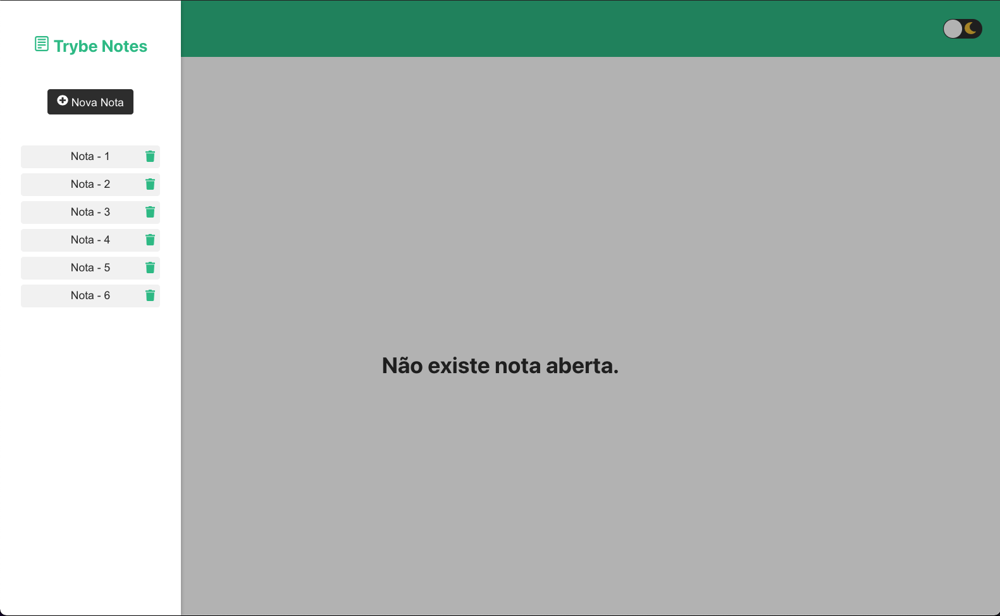

# Projeto Trybe Notes

## Iniciar o projeto
Para iniciar o projeto, basta instalar as dependências ``npm install``.
Logo após, rodar o comando ``npm start``.

ATENÇÃO: Os dados das notas estão sendo persistidos no localstorage.

## Preview

    

    

    

